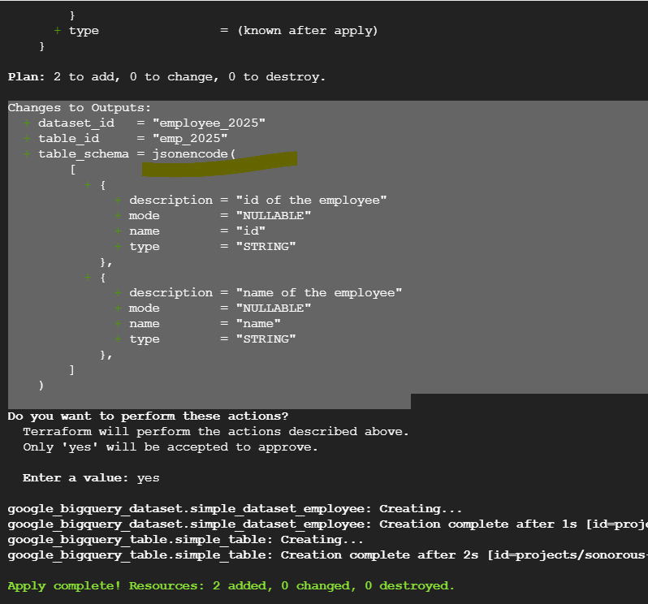
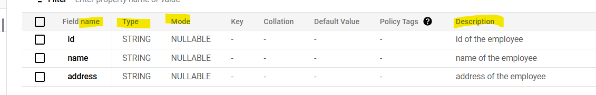

schema variable:

we  can modify the schema values in the terraform.tfvars file, 
The jsonencode function is used to convert the list of objects into a JSON string format that BigQuery understands for schema definition.
